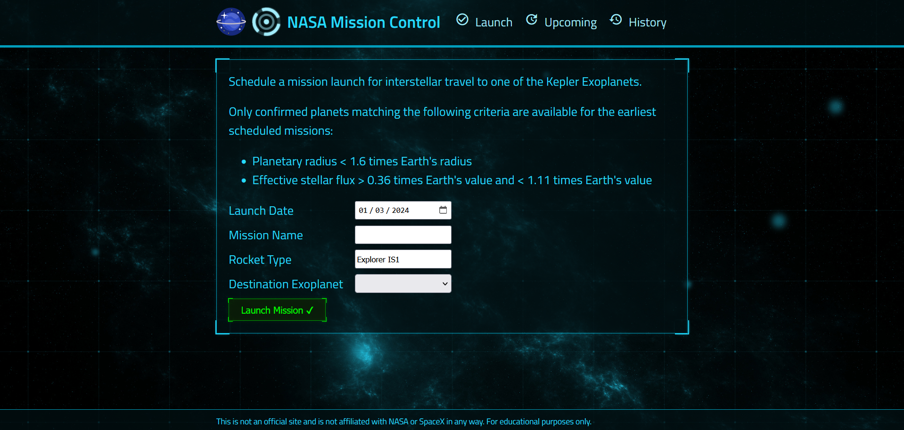

# nasa-project

Projeto Controle de Missão da NASA

Esta API foi construída para realizar operações de agendamento, alterações e remoção de missões espaciais. A API se integra ao MongoDB, um banco de dados não relacional, e está conectada a um frontend que serve como a interface principal para o controle de missões.

* Certifique-se de ter o Node.js instalado.
* Crie um banco de dados gratuito no Mongo Atlas online ou inicie um banco de dados MongoDB local.
* Crie um arquivo server/.env com uma propriedade MONGO_URL configurada com a string de conexão do seu MongoDB.
* No terminal, execute: npm install

## Executando o Projeto

* No terminal, execute: npm run deploy
* Acesse o frontend do controle de missão em localhost:8000 e agende um lançamento interestelar!

## Executando os Testes

Para executar testes automatizados, execute npm test. Isso fará o seguinte:

* Executará todos os testes do lado do cliente: npm test --prefix client
* Executará todos os testes do lado do servidor: npm test --prefix server

